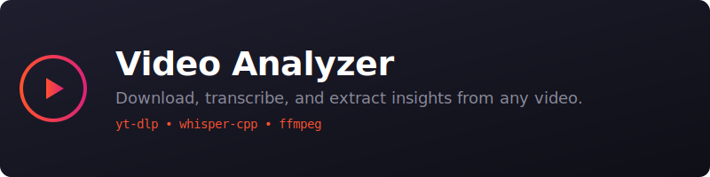

<p align="center">
  
</p>

<p align="center">
  <a href="https://clawhub.ai/skills/video-analyzer"></a>
  <a href="https://github.com/minilozio/video-analyzer-skill/blob/main/LICENSE"></a>
  
  
</p>

---

A powerful OpenClaw skill to download, transcribe, and analyze videos from YouTube, X/Twitter, TikTok, and more. 

It uses a smart two-tier architecture to get you the results as fast as possible, while keeping everything **100% free and private** by running models locally on your machine.

## ⚡ How it Works (Two-Tier Architecture)

1. **Level 1 (Fast Track):** If the video is on YouTube and has captions (manual or auto-generated), the skill uses `yt-dlp` to extract the subtitle text instantly. **Time to transcript: ~3 seconds.**
2. **Level 2 (Deep Fallback):** If it's a video on X/Twitter, TikTok, or a YouTube video without captions, the skill downloads the audio track and transcribes it locally using `whisper-cpp`. **Time to transcript: ~20 seconds** (for a 20-minute video on an M-series Mac).

Zero API keys needed. Zero cloud costs. 

## 🛠️ Features

- **Download:** Save any video as MP4 or extract the audio as MP3/M4A.
- **Transcribe:** Get accurate transcripts with **precise timestamps** (`[MM:SS] text`).
- **Analyze:** The agent automatically processes the transcript to give you a structured summary:
  - 📝 **TL;DR**
  - ⏱️ **Key Moments** (with timestamps)
  - 💡 **Actionable Insights**
- **Search:** Ask your agent "At what minute does he talk about X?" and it will pinpoint the exact timestamp.

## Install

### ClawHub (recommended)
```bash
clawhub install video-analyzer
```

### OpenClaw (manual)
```bash
cd ~/.openclaw/workspace/skills
git clone https://github.com/minilozio/video-analyzer-skill.git video-analyzer
```

## Dependencies

This skill relies on standard open-source tools. OpenClaw will attempt to install them automatically via Homebrew:
- `yt-dlp` (Universal media downloader)
- `ffmpeg` (Audio processing)
- `whisper-cpp` (Local transcription engine)
- `uv` (Fast python package manager)

## 🎛️ Quality Presets for Local Transcription

If the skill falls back to local Whisper transcription, it uses the multilingual `base` model by default. Two quality options:

- **Normal:** `--quality normal` — Fast (~1 min for 30 min video) - *Default*
- **Max:** `--quality max` — Best quality (~5 min for 30 min video)

Both models are **multilingual**. Send a video in Italian, Japanese, or Spanish — it just works.

*Models are automatically downloaded to `/opt/homebrew/share/whisper-cpp/` on first use.*

## 🗣️ Example Prompts

- *"Give me a summary and the key moments of this YouTube video: [link]"*
- *"Extract the audio from this X post and save it to my desktop: [link]"*
- *"Transcribe this TikTok using max quality settings: [link]"*
- *"In what minute of this podcast do they mention Solana? [link]"*

## License

MIT

---
*Built with 🦎 by [minilozio](https://github.com/minilozio)*